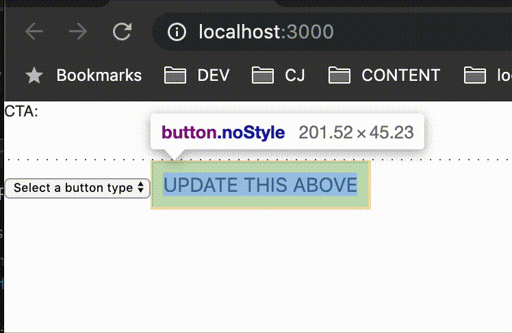
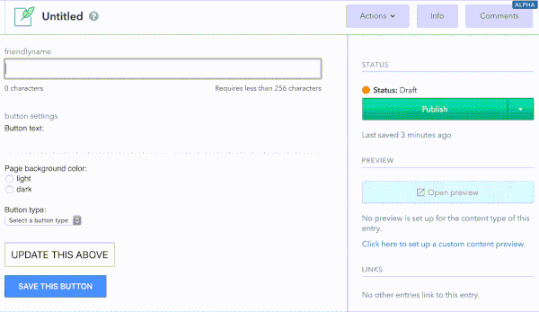
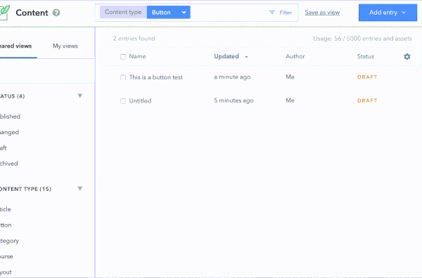
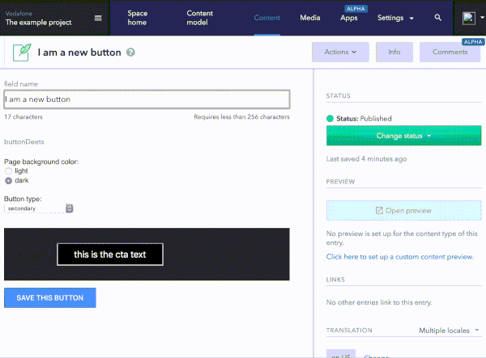

# React-Based Contentful UI Extension

Cloned from https://github.com/shiftlab/contentful-react-ui-extension

Experiments with contentful - needs env file to work

First go

  

  And then in contentful

  

  Showing that the data has saved on reload

  

  Hooking it up the the POC repo

  